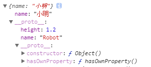
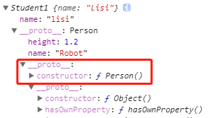

廖雪峰 JavaScript 教程

用来查漏补缺，又是一位膜拜的对象！

<!-- more -->

# 快速入门

多行字符串：由于多行字符串用\n写起来比较费事，所以最新的ES6标准新增了一种多行字符串的表示方法，用反引号 ` ... ` 表示

ES6新增了一种模板字符串，表示方法和上面的多行字符串一样，但是它会自动替换字符串中的变量

操作字符串
* 需要特别注意的是，字符串是不可变的，如果对字符串的某个索引赋值，不会有任何错误，但是，也没有任何效果
* JavaScript为字符串提供了一些常用方法，注意，调用这些方法本身不会改变原有字符串的内容，而是返回一个新字符串

操作数组
* 直接给Array的length赋一个新的值会导致Array大小的变化
* Array可以通过索引把对应的元素修改为新的值，对Array的索引进行赋值会直接修改这个Array，这一点不同于字符串
* 如果通过索引赋值时，索引超过了范围，同样会引起Array大小的变化
* indexOf 索引元素
* slice()就是对应String的substring()版本
* splice()方法是修改Array的“万能方法”，它可以从指定的索引开始删除若干元素，然后再从该位置添加若干元素

操作对象
* 如果我们要检测xiaoming是否拥有某一属性，可以用in操作符，不过要小心，如果in判断一个属性存在，这个属性不一定是xiaoming的，它可能是xiaoming继承得到的
* 要判断一个属性是否是xiaoming自身拥有的，而不是继承得到的，可以用hasOwnProperty()方法
* JavaScript的默认对象表示方式{}可以视为其他语言中的Map或Dictionary的数据结构，即一组键值对。JavaScript的对象有个小问题，就是键必须是字符串。但实际上Number或者其他数据类型作为键也是非常合理的。为了解决这个问题，最新的ES6规范引入了新的数据类型Map。
* Set和Map类似，也是一组key的集合，但不存储value。由于key不能重复，所以，在Set中，没有重复的key。
* 遍历Array可以采用下标循环，遍历Map和Set就无法使用下标。为了统一集合类型，ES6标准引入了新的iterable类型，Array、Map和Set都属于iterable类型。具有iterable类型的集合可以通过新的for-of循环来遍历。

for-in 和 for-of
* for-in循环由于历史遗留问题，它遍历的实际上是对象的属性名称。一个Array数组实际上也是一个对象，它的每个元素的索引被视为一个属性。
* 当我们手动给Array对象添加了额外的属性name后，for-in循环将带来意想不到的意外效果，for-in循环将把name包括在内，但Array的length属性却不包括在内。
* for-of循环则完全修复了这些问题，它只循环集合本身的元素
* 更好的方式是直接使用iterable内置的forEach方法

> 注意，forEach()方法是ES5.1标准引入的，你需要测试浏览器是否支持

操作函数
* arguments：JavaScript还有一个免费赠送的关键字arguments，它只在函数内部起作用，并且永远指向当前函数的调用者传入的所有参数。
* ES6标准引入了rest参数，rest参数只能写在最后，前面用...标识
* ES6标准引入了新的关键字const来定义常量，const与let都具有块级作用域
* 解构赋值
  * 支持嵌套
  * 如果要使用的变量名和属性名不一致，例子：把passport属性赋值给变量id，let {name, passport:id} = person;
  * 解构赋值还可以使用默认值（使用=），这样就避免了不存在的属性返回undefined的问题
* JavaScript的函数内部如果调用了this，那么这个this到底指向谁？答案是，视情况而定！
* 高阶函数
  * map
  * reduce
  * filter，利用filter巧妙去重
  ```js
    r = arr.filter(function (element, index, self) {
        return self.indexOf(element) === index;
    });
  ```
  * sort
    * 因为字符串根据ASCII码进行排序
    * 默认把所有元素先转换为String再排序
* 闭包
  * 返回闭包时牢记的一点就是：返回函数不要引用任何循环变量，或者后续会发生变化的变量。
  * 如果一定要引用循环变量怎么办？方法是再创建一个函数，用该函数的参数绑定循环变量当前的值，无论该循环变量后续如何更改，已绑定到函数参数的值不变
  * 使用场景
    * 封装私有变量
    * 把多参数的函数变成单参数的函数
* 箭头函数
  * 箭头函数相当于匿名函数，并且简化了函数定义。
  * 箭头函数和匿名函数有个明显的区别：箭头函数内部的this是词法作用域，由上下文确定。
* 生成器：generator

# 标准对象
包装对象
* 使用Number、Boolean和String时，没有写new会发生什么情况。Number、Boolean和String被当做普通函数，把任何类型的数据转换为number、boolean和string类型（注意不是其包装类型）
* 任何对象都有toString()方法吗？null和undefined就没有
* number对象调用toString()报SyntaxError，需要处理一下
```js
123..toString(); // '123', 注意是两个点！
(123).toString(); // '123'
```

总结一下，有这么几条规则需要遵守：
* 不要使用new Number()、new Boolean()、new String()创建包装对象；
* 用parseInt()或parseFloat()来转换任意类型到number；
* 用String()来转换任意类型到string，或者直接调用某个对象的toString()方法；
* 通常不必把任意类型转换为boolean再判断，因为可以直接写if (myVar) {...}；
* typeof操作符可以判断出number、boolean、string、function和undefined；
* 判断Array要使用Array.isArray(arr)；
* 判断null请使用myVar === null；
* 判断某个全局变量是否存在用typeof window.myVar === 'undefined'；
* 函数内部判断某个变量是否存在用typeof myVar === 'undefined'。

Date
* 略

RegExp
* [非常不错的正则基础知识和JS正则的使用](https://www.liaoxuefeng.com/wiki/001434446689867b27157e896e74d51a89c25cc8b43bdb3000/001434499503920bb7b42ff6627420da2ceae4babf6c4f2000)

JSON
* JSON是JavaScript Object Notation的缩写，它是一种数据交换格式。
* 在JSON出现之前，大家一直用XML来传递数据。
* 道格拉斯同学长期担任雅虎的高级架构师，自然钟情于JavaScript。他设计的JSON实际上是JavaScript的一个子集。
* JSON还定死了字符集必须是UTF-8，表示多语言就没有问题了。为了统一解析，JSON的字符串规定必须用双引号""，Object的键也必须用双引号""。
* 几乎所有编程语言都有解析JSON的库，而在JavaScript中，我们可以直接使用JSON，因为JavaScript内置了JSON的解析。
* 把任何JavaScript对象变成JSON，就是把这个对象序列化成一个JSON格式的字符串，这样才能够通过网络传递给其他计算机。
* 如果我们收到一个JSON格式的字符串，只需要把它反序列化成一个JavaScript对象，就可以在JavaScript中直接使用这个对象了。

JSON.stringify
* 最常用的是一个参数的情形，同时还支持第二个和第三个参数
* 第二个参数用于控制如何筛选对象的键值，如果我们只想输出指定的属性，可以传入Array
* 还可以传入一个函数，这样对象的每个键值对都会被函数先处理
* 如果我们还想要精确控制如何序列化对象，可以给对象定义一个toJSON()的方法，直接返回JSON应该序列化的数据
* 第三个参数控制输出缩进

JSON.parse
* 最常用的是一个参数的情形，同时还支持第二个
* 第二个参数可以接受一个函数，用来转换解析出的属性

# 面向对象编程
如果你熟悉Java或C#，很好，你一定明白面向对象的两个基本概念：
1. 类
2. 实例

所以，类和实例是大多数面向对象编程语言的基本概念。但在JavaScript中，这个概念需要改一改。JavaScript不区分类和实例的概念，而是通过原型（prototype）来实现面向对象编程。

假设有两个实例，xiaoming和Student，xiaoming如何想访问Student属性，简单粗暴的方法如下：
```js
xiaoming.__proto__ = Student;
```

经过实践，我们来分析几种情况
```js
// 方式1
var Student = {
  name: 'Robot',
  height: 1.2
};
var xiaoming = {
  name: '小明'
};

xiaoming.__proto__ = Student;

// 方式2
function Person() {
  this.name = 'Robot';
  this.height = 1.2;
}

function Student1() {
  this.name = 'lisi';
}

// 方式2
// Student1.prototype = new Person();

var person = new Person();

var lisi = new Student1();

// 方式3
lisi.__proto__ = person
```
分析如下，方式2和方式3的对象结构是相同的，但和方式1有细微不同，见图
 

区别其实很好理解，其实也就是通过new创建对象和花括号直接创建对象的区别，我们只需要知道new的原理和构造函数（即函数名）的prototype。
1. 最原始的函数名prototype属性只有两个属性，constructor指向自身函数和`__proto__`连接原型
2. 用 new 创建的对象还从原型上获得了一个 constructor 属性，从下面new模拟实现可以理解
3. new函数的模拟实现如下
```js
function objectFactory() {
  var obj = new Object(),
    Constructor = [].shift.call(arguments);
  obj.__proto__ = Constructor.prototype;
  var ret = Constructor.apply(obj, arguments);
  return typeof ret === 'object' ? ret : obj;
}
```

但不知道方式2和方式3结果完全一样，有没有引发你的思考呢，同样的，看上面的new的原理可以知道
1. 表面只是修改方法的prototype，此时并没有继承，继承代码：`Constructor.prototype = father`
2. 但是new的时候，内部实例的`obj.__proto__ = Constructor.prototype`
3. 因此实际为`obj.__proto__ = Constructor.prototype = father`，prototype属性只是起到了过渡的作用
4. 但是通过 prototype 起到了一次性修改的作用，后面创建的对象都将直接实现继承 

> JavaScript的原型链和Java的Class区别就在，它没有“Class”的概念，所有对象都是实例，所谓继承关系不过是把一个对象的原型指向另一个对象而已。因此，归根到底，js的继承通过`__proto__`实现，`son.__proto__ = father`

注意，在编写JavaScript代码时，不要直接用`obj.__proto__`去改变一个对象的原型，使用Object.create()方法可以传入一个原型对象（实例或函数的prototype属性），并创建一个基于该原型的新对象，但是新对象什么属性都没有。即：
```js
// 基于Student原型创建一个新对象:
var s = Object.create(Student);
// create的模拟实现
function createObj(o) {
  function F(){}
  F.prototype = o;
  return new F();
}
```

### 创建对象
数组原型链：arr ----> Array.prototype ----> Object.prototype ----> null

函数原型链：foo ----> Function.prototype ----> Object.prototype ----> null

很容易想到，如果原型链很长，那么访问一个对象的属性就会因为花更多的时间查找而变得更慢，因此要注意不要把原型链搞得太长。

如果对象方法属性，直接创建在构造函数内部的化，如下：
```js
function Student(name) {
    this.name = name;
    this.hello = function () {
        alert('Hello, ' + this.name + '!');
    }
}
```

如果我们通过new Student()创建了很多对象，这些对象的hello函数实际上只需要共享同一个函数就可以了，这样可以节省很多内存。

要让创建的对象共享一个hello函数，根据对象的属性查找原则，我们只要把hello函数移动到对象共同的原型上就可以了，也就是Student.prototype。

忘记写new怎么办
* 如果一个函数被定义为用于创建对象的构造函数，但是调用时忘记了写new怎么办？
* 在strict模式下，this.name = name将报错，因为this绑定为undefined，在非strict模式下，this.name = name不报错，因为this绑定为window，于是无意间创建了全局变量name，并且返回undefined，这个结果更糟糕。
* 所以，调用构造函数千万不要忘记写new。为了区分普通函数和构造函数，按照约定，构造函数首字母应当大写，而普通函数首字母应当小写，这样，一些语法检查工具如jslint将可以帮你检测到漏写的new。